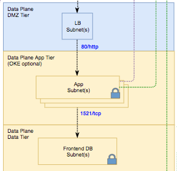

# TechCast Terraform Infrastructure

This is a Terraform configuration that deploys a basic sample infrastructure called "TechCast" on [Oracle Cloud Infrastructure (OCI)](https://www.oracle.com/cloud/).

"TechCast" is repurposed from the original MuShop basic OCI Quickstart, which is a 3-tier web application that implements an e-commerce site. This infrastructure is a stripped-down version of the original and just contains the networking, compute, KMS, and policy layers. To view the original MuShop application, please visit the OCI CloudNative quickstart guide here:
[https://github.com/oracle-quickstart/oci-cloudnative](https://github.com/oracle-quickstart/oci-cloudnative)

## Topology

The infrastructure uses a typical topology for a 3-tier web application as follows:



## Getting Started with TechCast Terraform Deployment

This is a Terraform configuration that deploys a basic sample architecture on Oracle Cloud Infrastructure and is designed to allow running Always Free tier resources.

The repository contains the [Terraform](https://www.terraform.io/) code to create a [Resource Manager](https://docs.cloud.oracle.com/iaas/Content/ResourceManager/Concepts/resourcemanager.htm) stack, that creates all the sample infrastructure for a 3-tier web application, complete with a network, load balancer, compute instances, and secret management Vault. To simplify getting started, the Resource Manager Stack is provided as a zip file in this directory called `techcast-basic-stack-latest.zip`

The steps below guide you through deploying the application on your tenancy using the OCI Resource Manager.

1. Download the latest [`techcast-basic-stack-latest.zip`](./techcast-basic-stack-latest.zip) file.
2. [Login](https://console.us-ashburn-1.oraclecloud.com/resourcemanager/stacks/create) to Oracle Cloud Infrastructure to import the stack
    > `Home > Solutions & Platform > Resource Manager > Stacks > Create Stack`
3. Upload the `techcast-basic-stack-latest.zip` file that was downloaded earlier, and provide a name and description for the stack
4. Configure the stack with available variables, or use the provided defaults.
5. Review the information and click Create button.
   > The upload can take a few seconds, after which you will be taken to the newly created stack
6. On Stack details page, click on `Terraform Actions > Apply`

All the resources in the stack will be created, and the URL to the load balancer will be displayed as `lb_public_url` as in the example below.
> The same information is displayed on the Application Information tab

```text
Outputs:

comments = The application URL will be unavailable as there is nothing yet configured in any instances to be served on the '/' path.
deployed_to_region = us-ashburn-1
dev = Repurposed by ECR Team for TechCast Days from original MuShop quickstart.

lb_public_url = http://xxx.xxx.xxx.xxx
techcast_basic_source_code = https://github.com/CannataUT/RDF-OLTP/tree/master/oci
```

> The application is being deployed to the compute instances asynchronously, and it may take a couple of minutes for the URL to serve the application.

### Cleanup

Even though it is Always Free, you will likely want to terminate the demo application
in your Oracle Cloud Infrastructure tenancy. With the use of Terraform, the [Resource Manager](https://docs.cloud.oracle.com/iaas/Content/ResourceManager/Concepts/resourcemanager.htm) stack is also responsible for terminating the application.

Follow these steps to completely remove all provisioned resources:

1. Return to the Oracle Cloud Infrastructure [Console](https://console.us-ashburn-1.oraclecloud.com/resourcemanager/stacks)
  > `Home > Solutions & Platform > Resource Manager > Stacks`
2. Select the stack created previously to open the Stack Details view
3. From the Stack Details, select `Terraform Actions > Destroy`
4. Confirm the **Destroy** job when prompted
  > The job status will be **In Progress** while resources are terminated
5. Once the destroy job has succeeded, return to the Stack Details page
6. Click `Delete Stack` and confirm when prompted
